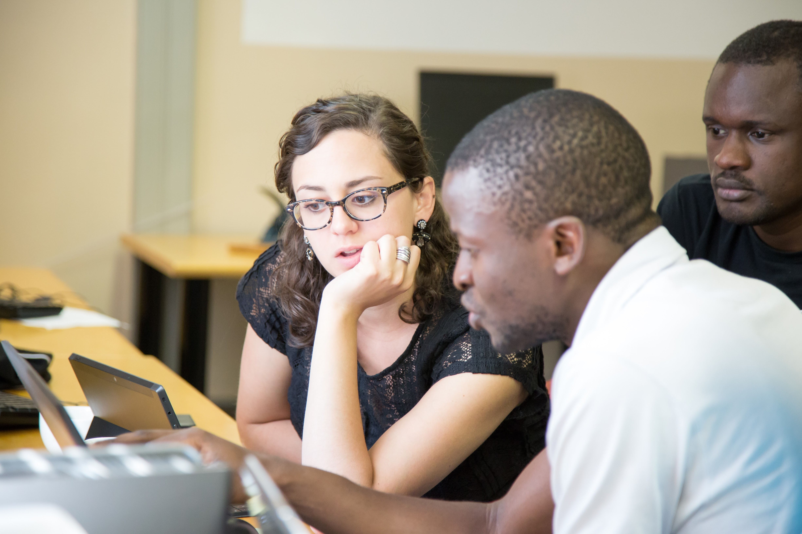

<!-- PAGE CONTENT -->

Training junior researchers from the US and Africa to conduct integrative research in infectious disease dynamics and to communicate their questions, methods, and findings across disciplinary boundaries.

			

				<section>
					

						

							
Mathematics and simulation are essential tools in infectious disease control, enabling decision-makers to explore control policies before implementing them, interpret trends, and predict emerging threats. The ICI3D Program provides intensive training in these methods to students and researchers from Africa and North America and aims to cultivate an international network of researchers from diverse backgrounds. The program comprises two distinct but overlapping International Clinics on Infectious Disease Dynamics and Data and a complementary research scholars exchange program. Promising young researchers are given repeated opportunities to interact with the Core Faculty, and we have created a pipeline for participants to gain successively more instructional responsibility, progressing from students to mentors to Workshop Faculty.

							
The ICI3D Core Faculty have worked together to run annual international workshops on meaningful epidemiological modeling since 2009. The ICI3D Program was launched in 2012 with funding from the National Institute of General Medical Sciences (R25GM102149).

						

						

							

								
							

						

					

					 
					

				</section>


